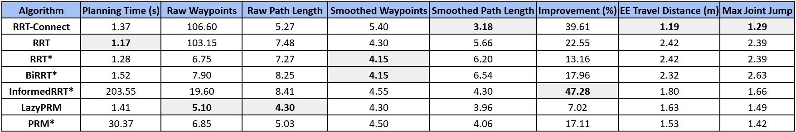

# Sampling-Based Motion Planning Benchmark for PR2 Manipulation

This project performs a systematic, multi-metric benchmark of seven widely used sampling-based motion planning algorithms on a 6-DOF PR2 robotic manipulator:

- **RRT-Connect**
- **RRT**
- **RRT***
- **BiRRT***
- **LazyPRM**
- **PRM***

Each planner is evaluated over repeated runs and compared using:

- **Planning time**
- **Number of waypoints**
- **Path length (raw & smoothed)**
- **Path improvement (%)**
- **End-effector travel distance**
- **Maximum joint jump**

All implementations (RRT, RRT*, PRM, smoothing, metrics, visualization) were written from scratch, and experiments are run in **PyBullet** using the PR2 robot.


This project was developed as part of **ROB 422: Introduction to Algorithmic Robotics** at the University of Michigan.

---

## 📦 Installation Instructions

First, clone the repository:

```bash
git clone https://github.com/aryamanr26/rrt-planning-suite.git
cd rrt-planning-suite
```
Install all dependencies automatically using the provided setup script:
```bash
bash ./install.sh
```
This creates and configures the conda environment named **rob422_project** and you need to activate the environment:
```bash
conda activate rob422_project
```
---

## 🚀 Running the Simulation

After installation, you can run the main demo simulation with

```bash
python demo.py
```
This launches PyBullet, runs the selected planner once, smooths the resulting path, and visualizes both:

- **Red** → raw RRT/PRM trajectory
- **Blue** → smoothed trajectory

---
## 🎯 Outcome

A sample aggregated comparison table:

<p align="center">
  
</p>


Stay Tuned for better results:)